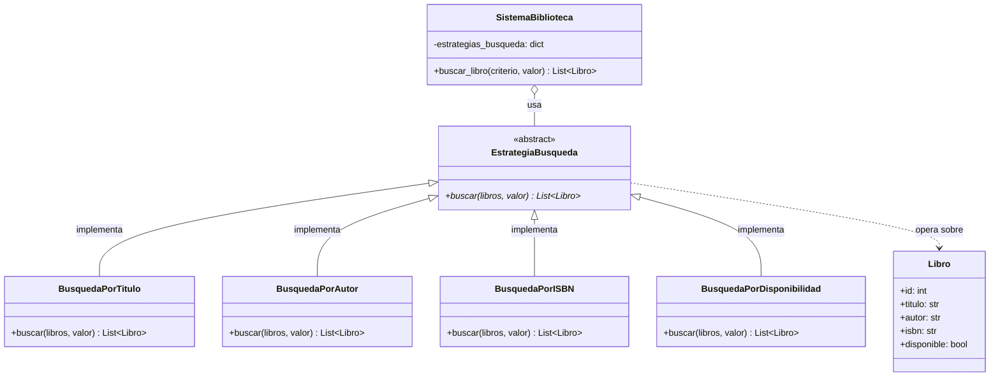
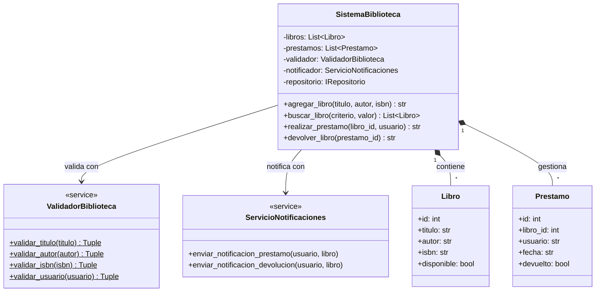
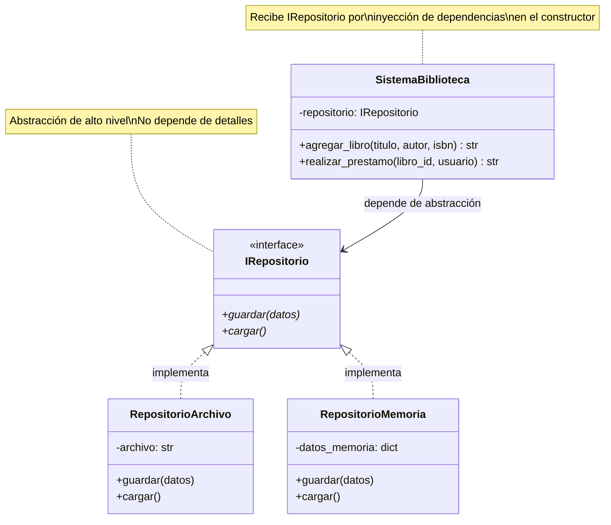
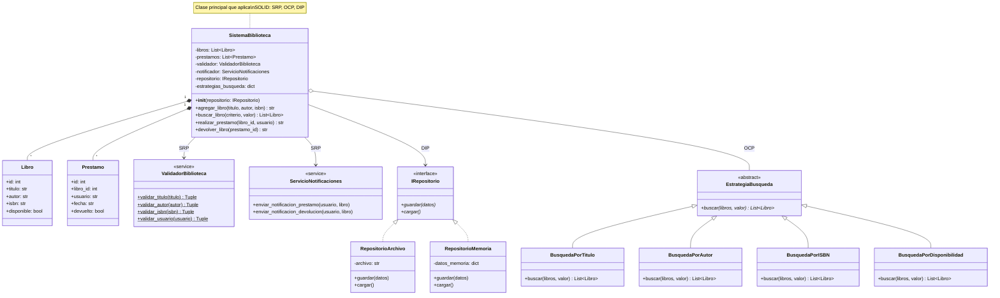

# Diagramas de Clases - Examen SOLID
**Alumno:** Tagle

---

## Diagrama 1: Ejercicio OCP - Patrón Strategy para Búsqueda

**Explicación OCP:**
- Abierto a extensión: Se pueden agregar nuevas estrategias (ej: BusquedaPorAño)
- Cerrado a modificación: No se modifica `buscar_libro()` al agregar estrategias
- El diccionario `estrategias_busqueda` permite extensibilidad

---

## Diagrama 2: Ejercicio SRP - Separación de Responsabilidades

**Explicación SRP:**
- **ValidadorBiblioteca**: Solo responsable de validar datos
- **ServicioNotificaciones**: Solo responsable de notificar
- **SistemaBiblioteca**: Solo responsable de lógica de negocio (coordinación)
- Cada clase tiene una única razón para cambiar

---

## Diagrama 3: Ejercicio DIP - Inversión de Dependencias

**Explicación DIP:**
- **Alto nivel** (SistemaBiblioteca) depende de abstracción (IRepositorio)
- **Bajo nivel** (RepositorioArchivo, RepositorioMemoria) implementan abstracción
- Inversión: Módulos de alto nivel NO dependen de módulos de bajo nivel
- Ambos dependen de abstracciones
- Inyección de dependencias en constructor

---

## Diagrama 4: Arquitectura Completa (SOLID Integrado)

---

## Resumen de Principios SOLID Aplicados

| Principio | Implementación | Beneficio |
|-----------|---------------|-----------|
| **SRP** | ValidadorBiblioteca, ServicioNotificaciones separados | Cada clase tiene una sola responsabilidad |
| **OCP** | Patrón Strategy con EstrategiaBusqueda | Extensible sin modificar código existente |
| **LSP** | Todas las estrategias sustituyen a EstrategiaBusqueda | Polimorfismo correcto |
| **ISP** | Interfaces pequeñas (IRepositorio simple) | Clientes no dependen de métodos innecesarios |
| **DIP** | SistemaBiblioteca depende de IRepositorio (abstracción) | Fácil cambio de implementación |

---

## Cómo visualizar estos diagramas

1. **GitHub**: Los diagramas se renderizan automáticamente en archivos .md
2. **VS Code**: Instalar extensión "Markdown Preview Mermaid Support"
3. **Online**: Copiar código a https://mermaid.live/

---

**Fin de los diagramas**